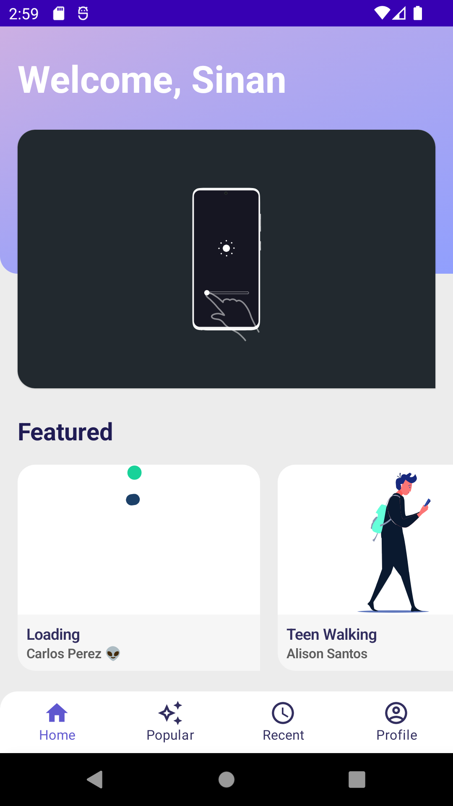
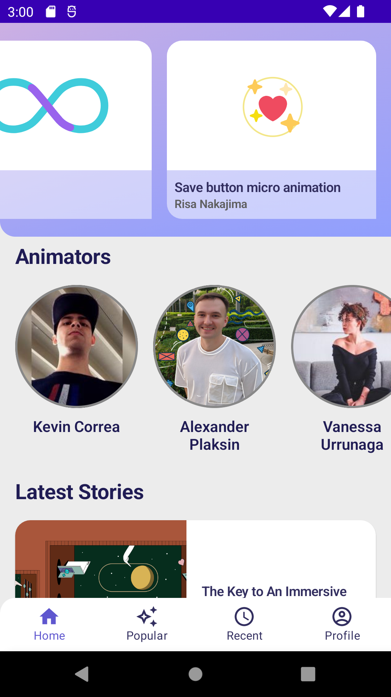
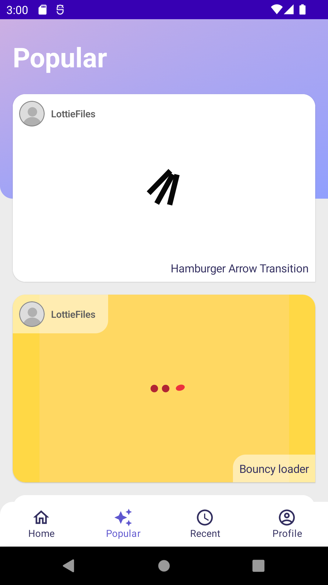
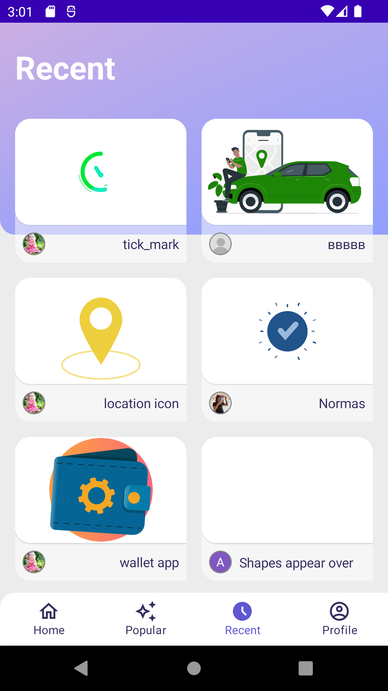
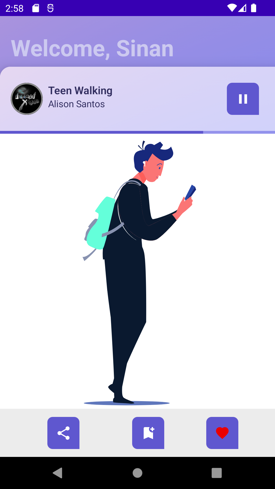
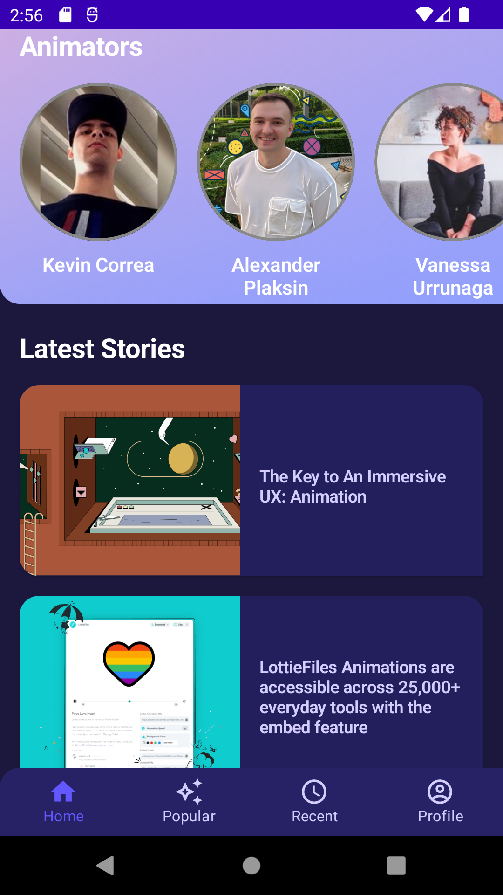
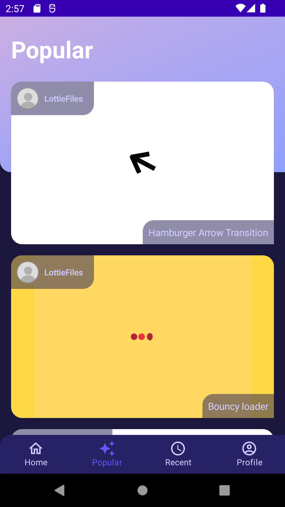
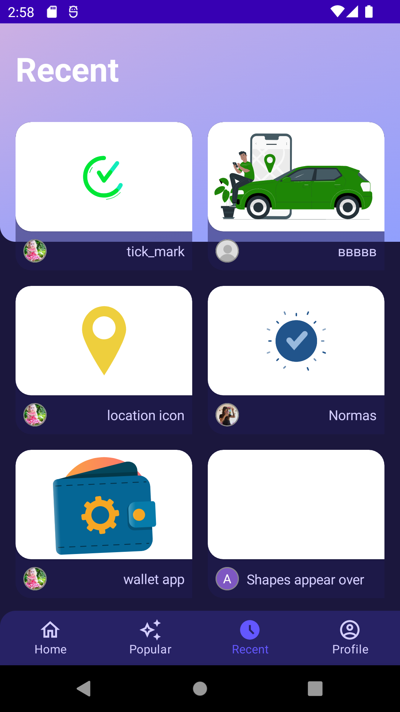
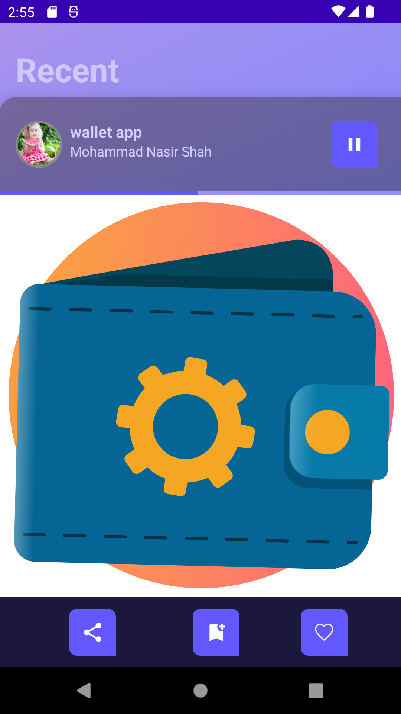

# LottieFiles

LottieFiles is a marketplace application where you can find animations.

Some Key Features
---------------
- UI is implemented in declarative way using Jetpack Compose
- Dark Theme is supported. App randomly launches in dark mode for the sake of simplicity for now
- Design system is implemented for Buttons, Texts, Colors, Sizes
- Following structures are used for clean code: Entity/DTO, UseCase, Repository, Webservice, Database, ViewModel
- Data is transferred to UI using ViewModels
- Robolectric and Espresso is used for testing ViewModels in JVM environment for Unit testing
- Data from API is cached using Room
- Hilt is used for Dependency Injection
- Jetpack Compose Navigation is used for routing

Missing Pieces
---------------
- QR Code scan is not implemented as it will not provide a better understanding of code quality now.
- Error Handling is not implemented for Webservice. App will not crash but API will fail silently.
- Progress during API calls is not implemented.
- No credentials is required in order to login.
- CI/CD pipeline, Crashlytics, and other essential part of production system is missing.

Getting Started
---------------
This project uses the Gradle build system. To build this project, use the
`./gradlew build` command or use "Import Project" in Android Studio.

There are one Gradle tasks for testing the project:
`./gradlew test` - for running unit tests

For more resources on learning Android development, visit the
[Developer Guides](https://developer.android.com/guide/) at
[developer.android.com](https://developer.android.com).

Screenshots
-----------
\

### Dark Theme
\

Libraries Used
--------------
* [Lottie][0] - Lottie animation library
* [Foundation][1] - Components for core system capabilities, Kotlin extensions and support for
  multidex and automated testing.
    * [Jetpack Compose][2]: https://developer.android.com/jetpack/compose
    * [Android KTX][3] - Write more concise, idiomatic Kotlin code.
    * [Test][4] - An Android testing framework for unit and runtime UI tests.
    * [Robolectric][5] - Testing framework that brings fast and reliable unit tests to Android.
* [Architecture][10] - A collection of libraries that help you design robust, testable, and
  maintainable apps. Start with classes for managing your UI component lifecycle and handling data
  persistence.
    * [Lifecycles][12] - Create a UI that automatically responds to lifecycle events.
    * [Navigation][14] - Handle everything needed for in-app navigation.
    * [Room][16] - Access your app's SQLite database with in-app objects and compile-time checks.
    * [ViewModel][17] - Store UI-related data that isn't destroyed on app rotations. Easily schedule
      asynchronous tasks for optimal execution.
* Data transfer and serialization components
    * [OkHttp3][31] - HTTP consumption library.
    * [Retrofit][32] - Typesafe API/Webservice definition library.
    * [KotlinX Serialization][33] - Json Serialization/Deserialization library.
  
* Third party and miscellaneous libraries
    * [Coil][90] Compose-Ready Kotlin based image loading library
    * [Hilt][92]: for [dependency injection][93]
    * [Kotlin Coroutines][91] for managing background threads with simplified code and reducing needs for callbacks
    * [Refresh Versions][94]: an easy way to manage dependency versions.
    
[0]: https://github.com/airbnb/lottie-android
[1]: https://developer.android.com/jetpack/components
[2]: https://developer.android.com/jetpack/compose
[3]: https://developer.android.com/kotlin/ktx
[4]: https://developer.android.com/training/testing
[5]: http://robolectric.org
[10]: https://developer.android.com/jetpack/arch
[12]: https://developer.android.com/topic/libraries/architecture/lifecycle
[14]: https://developer.android.com/topic/libraries/architecture/navigation
[16]: https://developer.android.com/topic/libraries/architecture/room
[17]: https://developer.android.com/topic/libraries/architecture/viewmodel
[31]: https://square.github.io/okhttp
[32]: https://square.github.io/retrofit
[33]: https://github.com/Kotlin/kotlinx.serialization
[90]: https://coil-kt.github.io/coil
[91]: https://kotlinlang.org/docs/reference/coroutines-overview.html
[92]: https://developer.android.com/training/dependency-injection/hilt-android
[93]: https://developer.android.com/training/dependency-injection
[94]: https://github.com/jmfayard/refreshVersions
